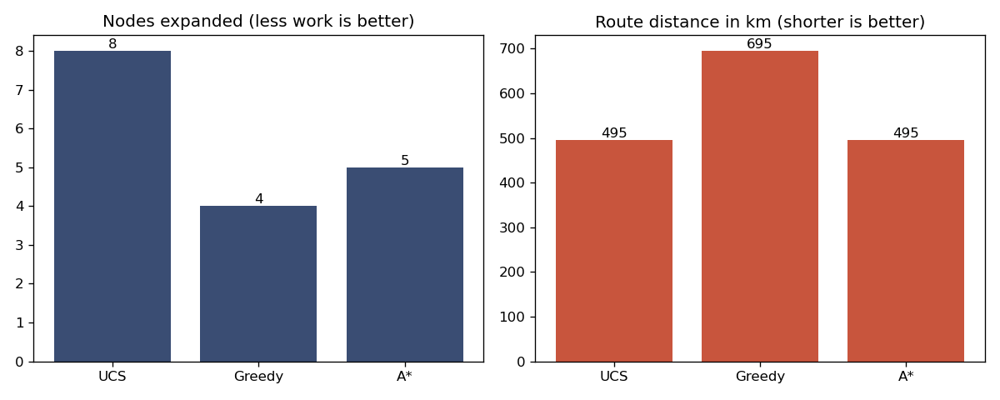

# AI Lab 04 — Informed Search: Greedy Best-First & A*

**CS344L — Artificial Intelligence Lab · Week 4 · BSCS, Air University**

Week 3's blind searches (BFS, DFS, UCS, DLS, IDS) knew nothing about the goal's direction. This lab adds a **heuristic** `h(n)` — a straight-line-distance estimate of the cost still left — and builds the two informed searches that use it:

- **Greedy Best-First Search** — expands the node with the smallest `h` (`f = h`)
- **A\* Search** — expands the node with the smallest `f = g + h`, where `g` is the cost already paid

Everything runs on the same 11-city northern Pakistan road map from Lab 03 (Peshawar → Lahore), and one shared search engine drives every algorithm — only the evaluation function `f` changes.

## Lab objectives

- Represent a heuristic for a route-finding problem and check when it is safe to use
- Understand **admissibility** (`h` never overestimates) and **consistency** (`h(n) ≤ c(n,n′) + h(n′)`)
- Implement Greedy Best-First and A* on a common best-first engine
- Compare UCS, Greedy and A* on identical input
- Apply the same A* to the 8-puzzle with two heuristics and measure the difference
- Show, on purpose, how an overestimating heuristic breaks A*'s optimality guarantee

## The map and the heuristic

13 roads connect 11 cities (Peshawar, Islamabad, Rawalpindi, Abbottabad, Murree, Jhelum, Gujranwala, Lahore, Sargodha, Faisalabad, Multan). The heuristic is the straight-line distance to Lahore, e.g. `h(Peshawar) = 375`, `h(Lahore) = 0`.

## What's inside

| Part | File | What it does |
|---|---|---|
| 1 | `part1_map_and_heuristic.py` | Builds the adjacency graph from the road list and prints the heuristic table |
| 2 | `part2_check_heuristic.py` | Verifies `h` is **admissible** (vs. true costs from a Dijkstra run) and **consistent** on every road — then triples `h` to show both checks fail |
| 3 | `part3_problem_and_node.py` | `RouteProblem` (now with `h()`) and `Node` with `g`, `h`, `f = g + h`, depth and path reconstruction |
| 4 | `part4_greedy_search.py` | The shared `best_first_search` engine + Greedy (`f = h`), with a step-by-step frontier trace |
| 5 | `part5_astar_search.py` | A* (`f = g + h`) by swapping one function — plus a side-by-side with Greedy |
| 6 | `part6_compare_three.py` | One engine, three algorithms (UCS vs Greedy vs A*) and a bar chart of work vs. distance |
| 7 | `part7_eight_puzzle.py` | The same A* on the 8-puzzle: misplaced-tiles vs. Manhattan heuristic |
| 8 | `part8_break hueristic.py` | Experiment: multiply `h` by 3 and watch A* return a longer route |

The submitted lab report (`242816_lab_04.docx`) contains the output screenshots for all eight parts.

## Verified results (Peshawar → Lahore)

| Algorithm | Route | Distance | Expanded |
|---|---|---|---|
| UCS (`f = g`) | Peshawar → Islamabad → Rawalpindi → Jhelum → Gujranwala → Lahore | **495 km** | 8 |
| Greedy (`f = h`) | Peshawar → Islamabad → Sargodha → Faisalabad → Lahore | 695 km | 4 |
| A* (`f = g + h`) | Peshawar → Islamabad → Rawalpindi → Jhelum → Gujranwala → Lahore | **495 km** | 5 |

**8-puzzle** (start `7 2 4 / 5 _ 6 / 8 3 1`, optimal solution 20 moves):

| Heuristic | Moves | Expanded | Generated |
|---|---|---|---|
| Misplaced tiles | 20 | 3,666 | 9,901 |
| Manhattan distance | 20 | **282** | 748 |



## Key observations

- **Greedy is fast but careless.** At Islamabad it picks Sargodha (lower `h`) over Rawalpindi and pays a 235 km road for it — 695 km total, 200 km worse than optimal.
- **A\* is the best of both.** It expands fewer nodes than blind UCS (5 vs. 8) and still guarantees the 495 km optimum, because the straight-line heuristic is admissible and consistent — along the A* route, `f` never decreases (375 → 450 → 455 → 475 → 490 → 495).
- **A better heuristic beats a cleverer algorithm.** Manhattan dominates misplaced-tiles, so the identical A* expands ~13× fewer nodes on the 8-puzzle for the same 20-move answer.
- **Break the heuristic, break A\*.** With `h` tripled, A* still terminates quickly but returns the 695 km Greedy-style route — optimality only holds when `h` never overestimates.

## Tech stack

- Python 3 (standard library only: `heapq`, `itertools`, `time`)
- `matplotlib` — used only by Part 6 for the comparison chart

## How to run

Parts 5–8 import the engine from Parts 4–5, so keep all files in one folder:

```bash
python part1_map_and_heuristic.py
python part2_check_heuristic.py
python part3_problem_and_node.py
python part4_greedy_search.py
python part5_astar_search.py
python part6_compare_three.py     # needs matplotlib; saves part6_comparison.png
python part7_eight_puzzle.py
python "part8_break hueristic.py" # quotes needed — space in the filename
```

## Project structure

```
ai-lab-04/
├── part1_map_and_heuristic.py
├── part2_check_heuristic.py
├── part3_problem_and_node.py
├── part4_greedy_search.py
├── part5_astar_search.py
├── part6_compare_three.py
├── part6_comparison.png
├── part7_eight_puzzle.py
├── part8_break hueristic.py
├── 242816_lab_04.docx        # submitted lab report (output screenshots)
└── README.md
```

## Notes

- Part 1's closing "quick check" block is indented inside the city loop, so it repeats once per city instead of printing once — cosmetic only, the numbers are unaffected.
- Part 8's filename keeps its original spelling (`hueristic`, with a space); run it with quotes as shown above.

---
*BSCS coursework — Air University, Islamabad. Lab 03 (uninformed search) lives in [ai-lab-03](https://github.com/hussnainahmedd/ai-lab-03).*
